# GITHUB ACTIONS
GitHub Actions is a continuous integration and continuous delivery (CI/CD) platform that allows you to automate your build, test, and deployment pipeline. You can create workflows that build and test every pull request to your repository, or deploy merged pull requests to production.

The Actions was built to carry out two workflow dispatch which includes "Terraform apply" and "Terraform destroy".Github actions was used to create S3 bucket, DynamoDB table, Kubenetes cluster in AWS and install ArgoCD, aws-alb-nginx-Ingress controller and Cert Manager in the cluster.

### TERRAFORM-S3-DB
This directory hold the terraform resources used to create an s3 bucket and a dynamodb table.

The S3 was used to store the terraform state files while dynamodb was used to lock the statefile so that no one can make changes to the state files 

### TERRAFORM-EKS 
This directory contains the necessary resources for creating an EKS cluster using Terraform. This directory holds the Terraform scripts that are responsible for creating AWS EKS (Elastic Kubernetes Service) Cluster on AWS cloud provider
The `terraform-eks` folder contains all the necessary files for creating the EKS cluster which includes:
- iam roles and policies attached to the cluster.
- vpc with public and private subnets in three availability zones.
- Security groups for the worker nodes.
- Keys to access the workernodes within the cluster.
- eks-csi-drive addon to attach volumes to any pods requiring more volume.

### ARGOCD INSTALLATION
ArgoCD was installed with github actions but first the cluster was accessed with this command 

`aws eks update-kubeconfig --name <name of cluster>`

To install ArgoCD on your Kubernetes you can go through this [documentation](https://argo-cd.readthedocs.io/en/stable/getting_started/) 

For this project, I clicked on (https://github.com/argoproj/argo-cd/releases/latest) which is the second optio in the documentation above. I was redirected to this github repo (https://github.com/argoproj/argo-cd/releases/tag/v2.
9.7). I clicked on releases and used the version `v.2.10.2`

### NGINX-INGRESS CONTROLLER AND CERT MANAGER
The helm charts for ingress-nginx was installed and the YAML file of cert manger was deployed so that we can generate a free ssl certificate that will be issued issued to the domain name `sockshop.zenitugo.com.ng`. This is to allow the web application be viewed over port 443 (https).

To install them execute the bash script `install.sh` on the eks cluster

### SLACK ALERTS
I configured a slack channel to my CI pipeline so I can get notified when the CI pipeline has been fully executed.

### PROOF OF THE RESOURCES CREATED WITH GITHUB ACTIONS
**Image of github actions executing terraform script**
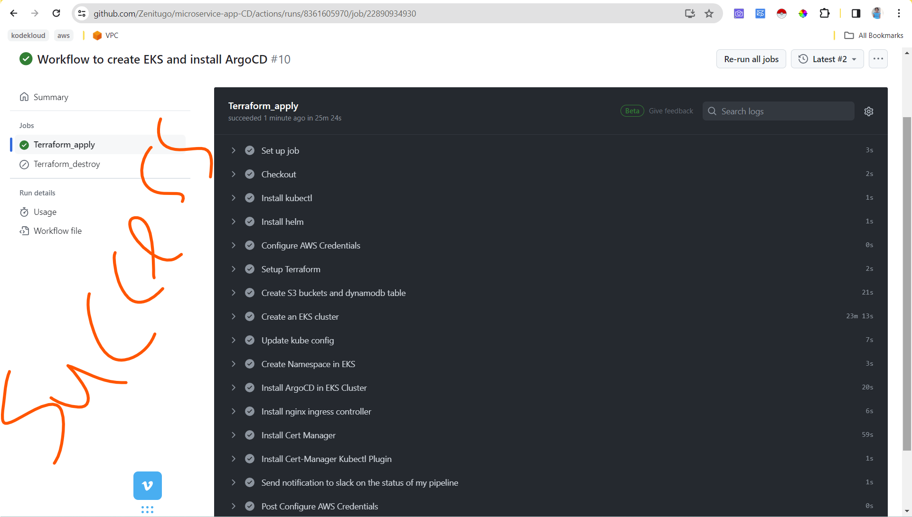

**Image of Slack Notification from Github Actions**
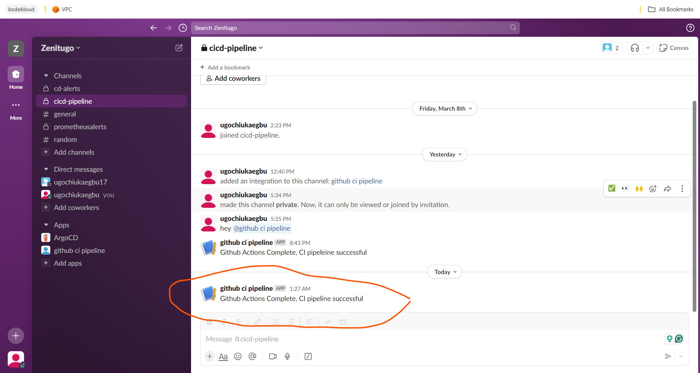

**Image of VPC, subnets, nat-gateway, eip, route-tables, S3, dynamoDB, iam, oidc created**
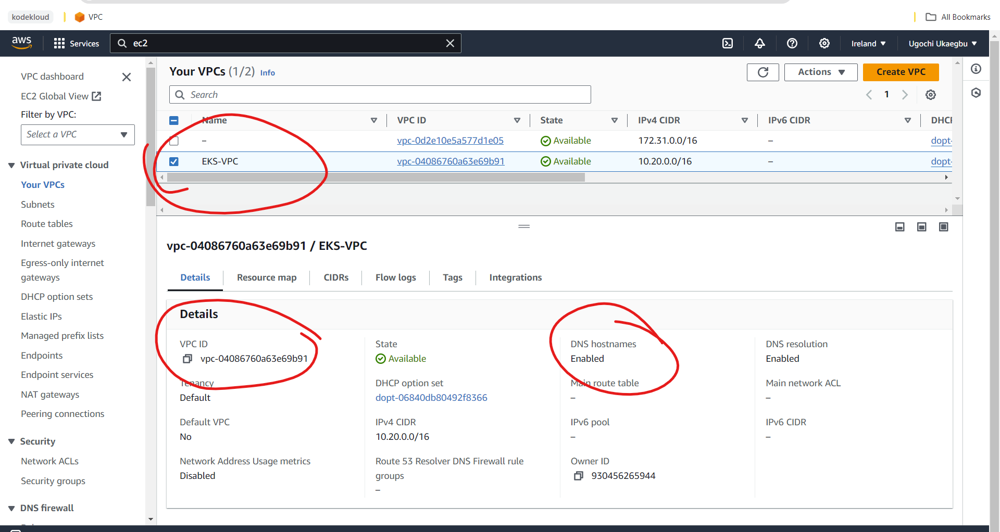
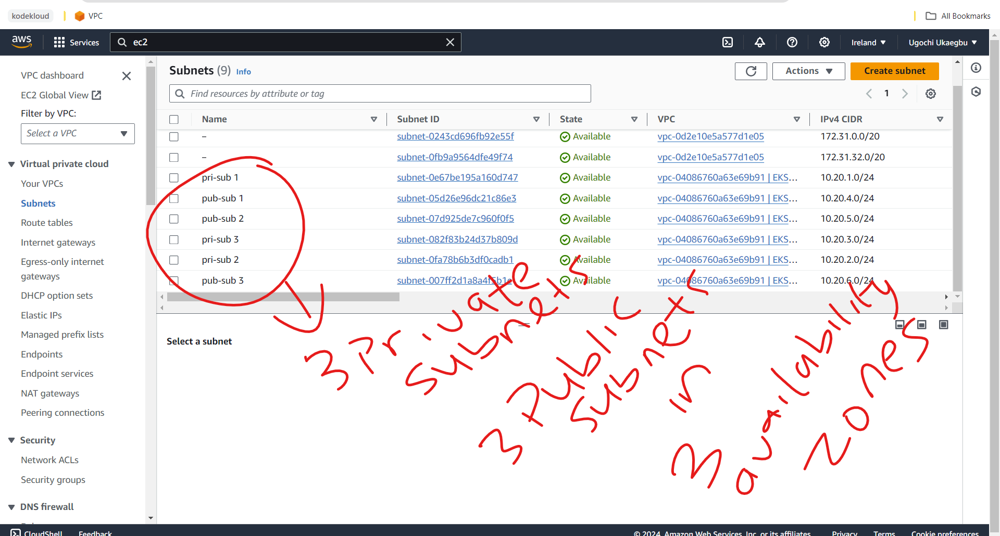
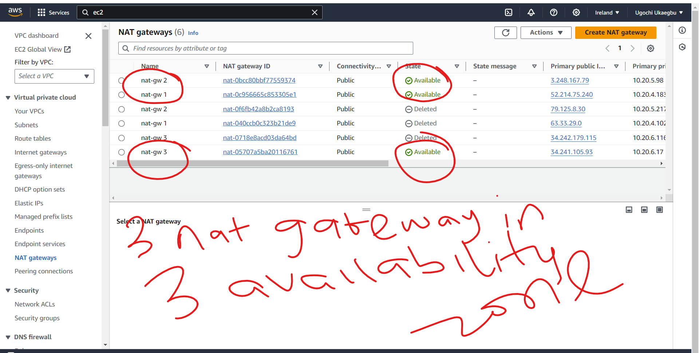
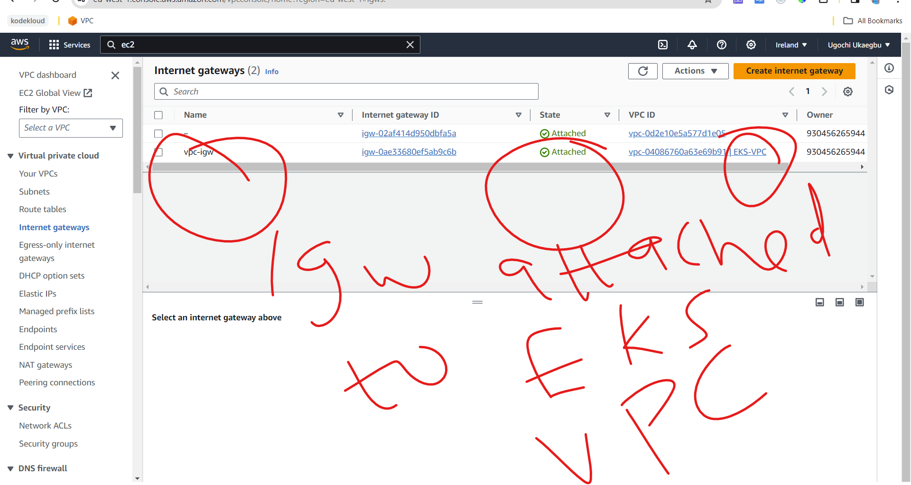
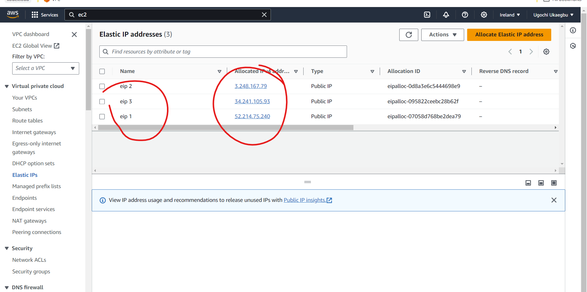
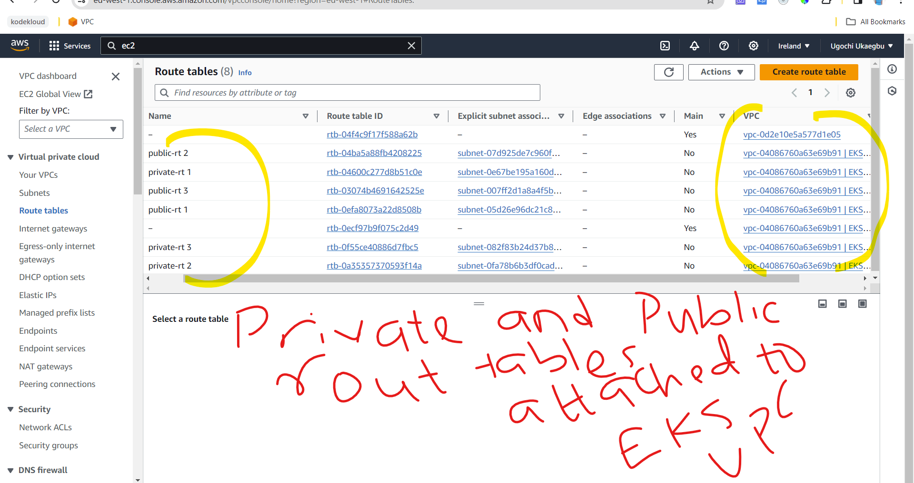
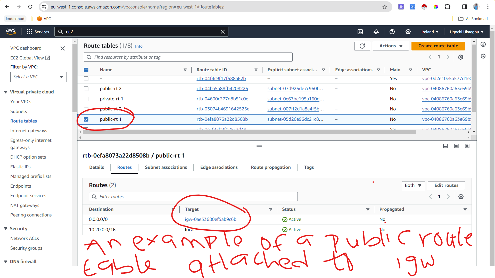
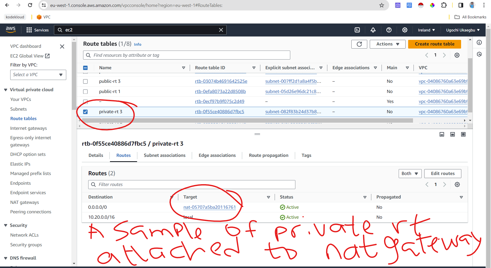
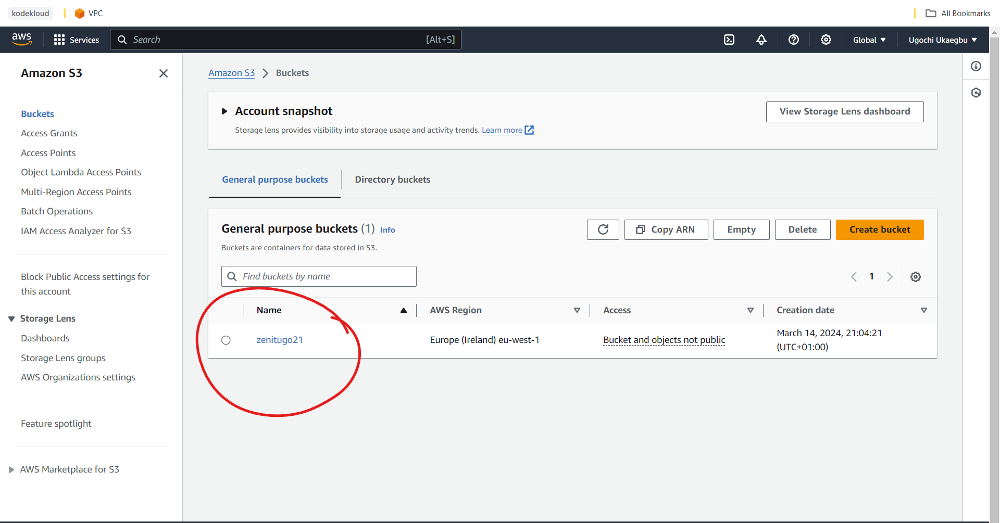
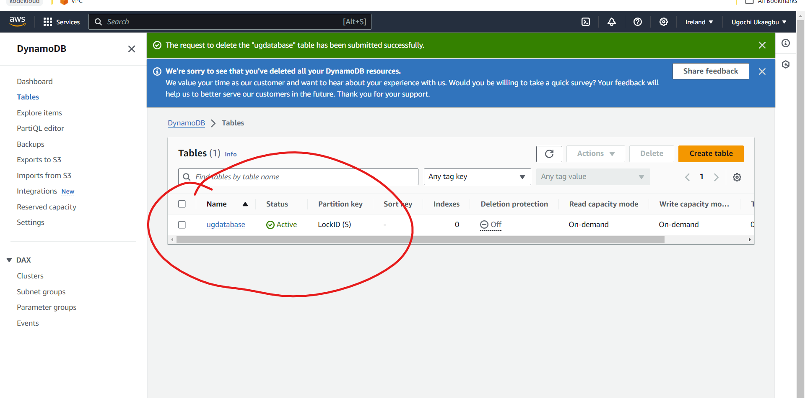
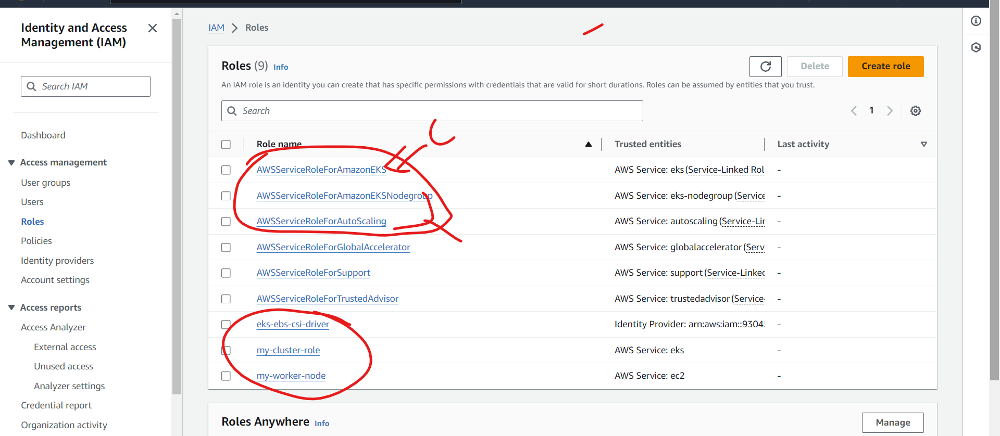
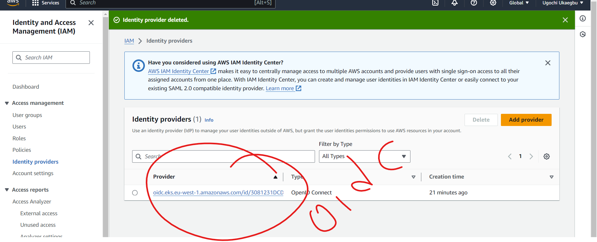
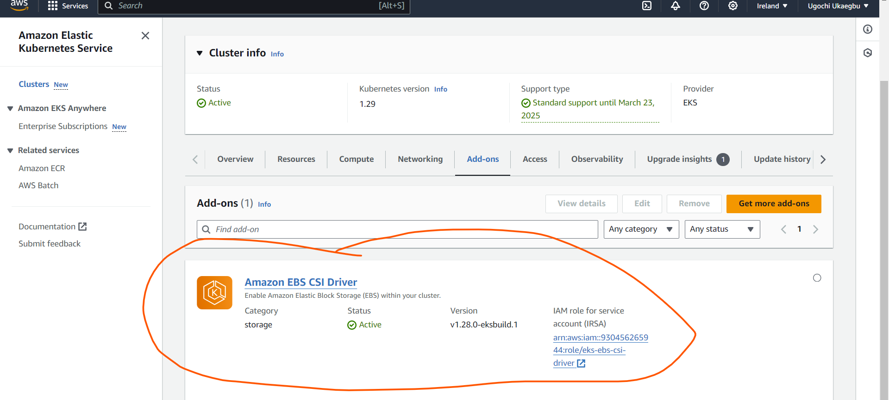

**Images of eks and worker nodes**
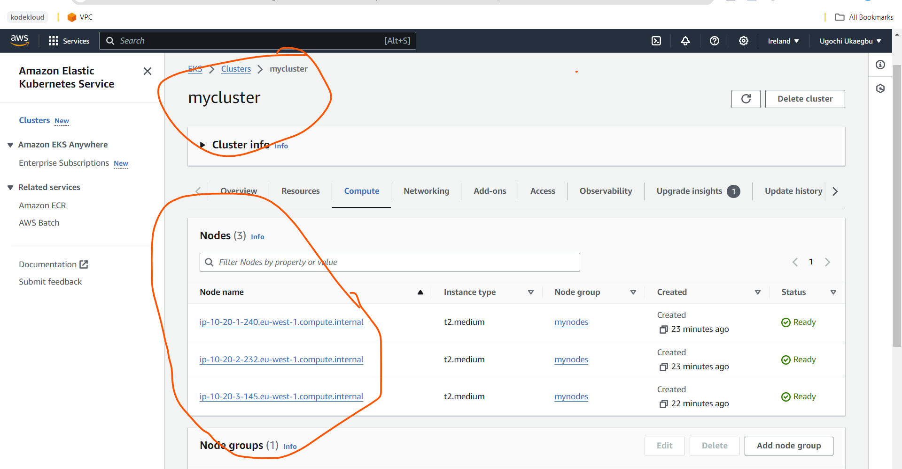
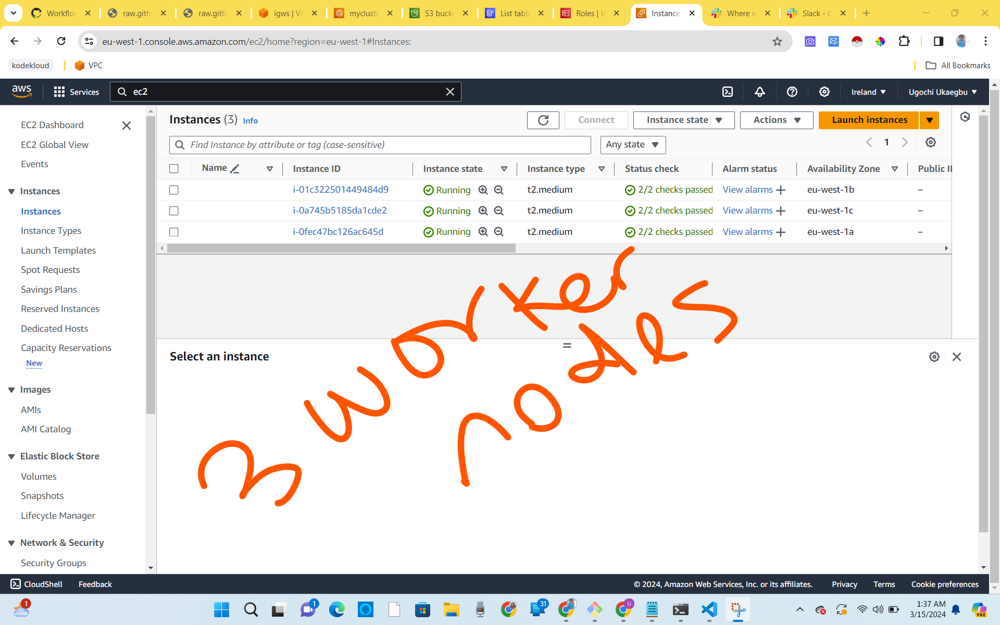

**Images of some of ingress, cert manager and argocd resources**
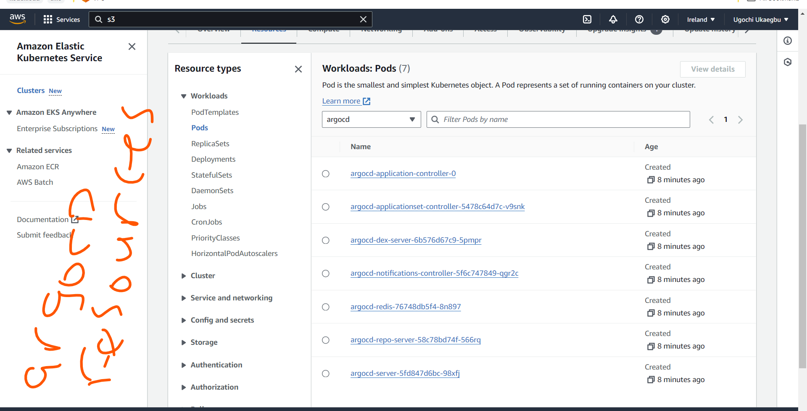

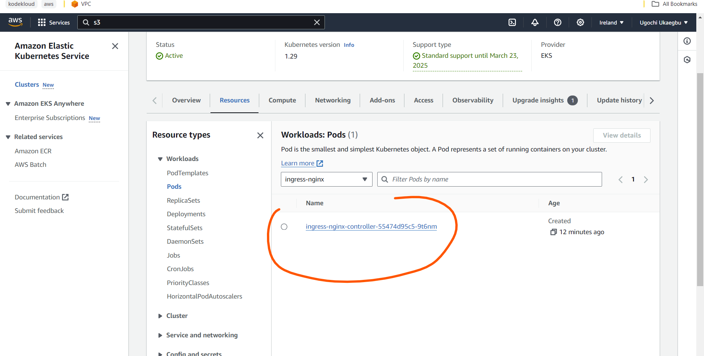
