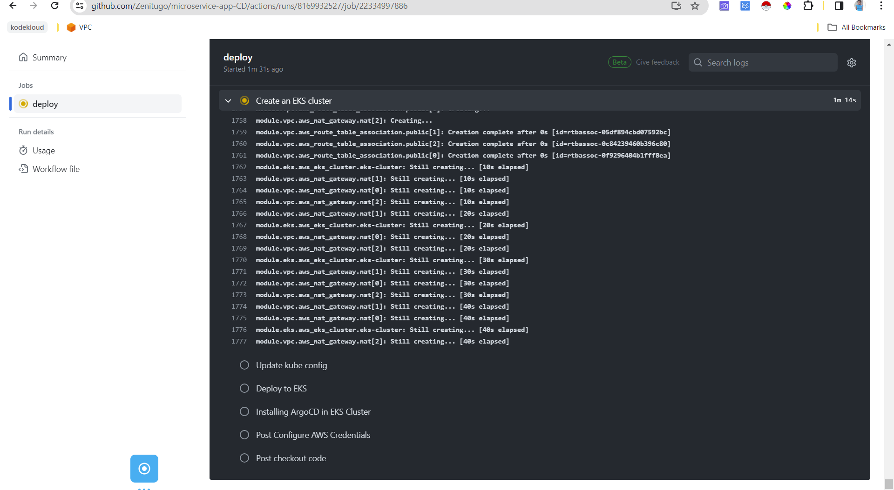

# TOOL USED IN THIS PROJECT
- Github Actions
- ArgoCD

# GITHUB ACTIONS
Github actions was used to create S3 bucket, DynamoDB table, Kubenetes cluster in AWS and install ArgoCD in the cluster
## TERRAFORM-S3-DB
This directory hold the terraform resources used to create an s3 bucket and a dynamodb table.

The S3 was used to store the terraform state files while dynamodb was used to lock the statefile so that no one can make changes to the state files 

## TERRAFORM-EKS 
This directory contains the necessary resources for creating an EKS cluster using Terraform. This directory holds the Terraform scripts that are responsible for creating AWS EKS (Elastic Kubernetes Service) Cluster on AWS cloud provider
The `terraform-eks` folder contains all the necessary files for creating the EKS cluster which includes:
- iam roles and policies attached to the cluster.
- vpc with public and private subnets in three availability zones.
- Security groups for the worker nodes.
- Keys to access the workernodes within the cluster.

## ARGOCD INSTALLATION
ArgoCD was installed with github actions but first the cluster was accessed with this command `aws eks update-kubeconfig --name <name of cluster>`
To install ArgoCD on your Kubernetes you can go through this [documentation](https://argo-cd.readthedocs.io/en/stable/getting_started/) 

For this project, I clicked on (https://github.com/argoproj/argo-cd/releases/latest) which is the second optio in the documentation above. I was redirected to this github repo (https://github.com/argoproj/argo-cd/releases/tag/v2.9.7). I clicked on releases and used the version `v.2.10.2`

## PROOF OF THE RESOURCES CREATED WITH GITHUB ACTIONS
**Image of github actions executing terraform script**

To edit argocd server run: `kubectl get svc -n argocd

# ARGOCD DEPLOYMENT OF SOCKS SHOP APPLICATION