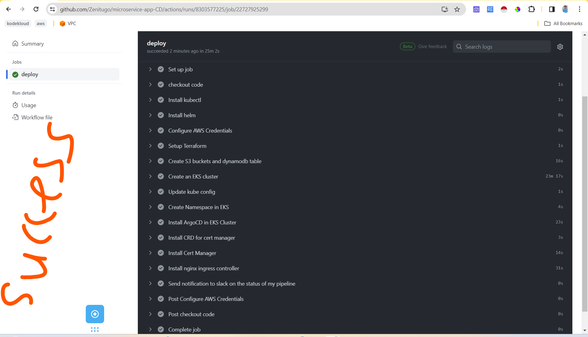
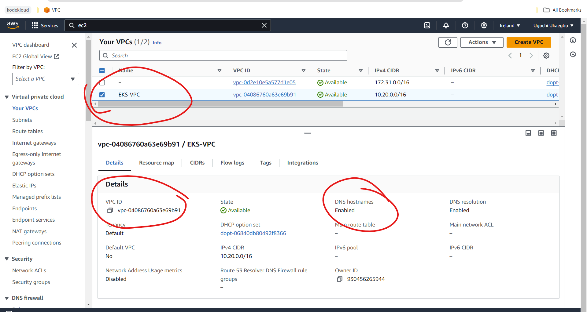
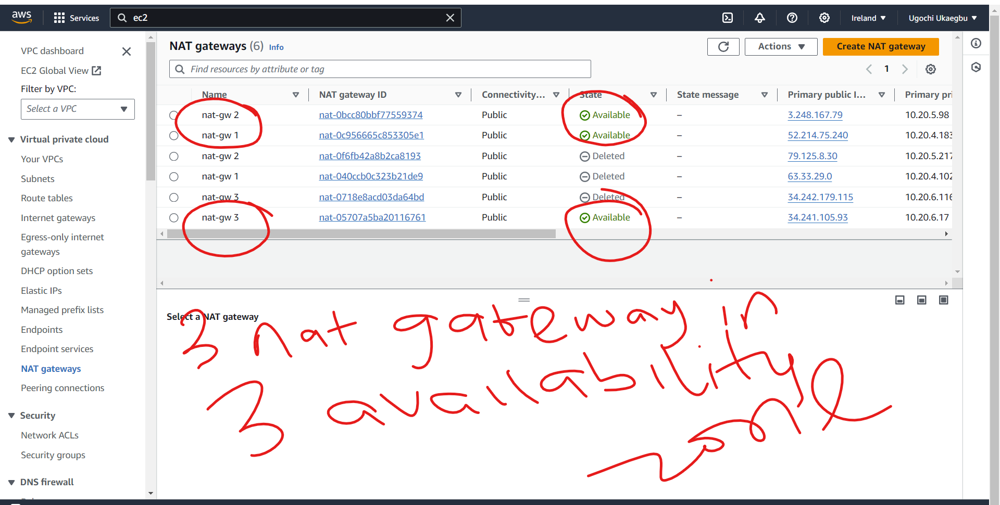

# TOOL USED IN THIS PROJECT
- Github Actions for creating the Elastic Kubernetes Service and installing argocd in the cluster.
- ArgoCD for deploy application on AWS Elastic Kubernetes Service
- Prometheus for monitoring cluster
- Grafana for visualizing metrics gotten with prometheus
- ELK which stands for ElasticSearch Logstash & Kibana for logging


# GITHUB ACTIONS
Github actions was used to create S3 bucket, DynamoDB table, Kubenetes cluster in AWS and install ArgoCD, Nginx-Ingress controller and Cert Manager in the cluster.

## TERRAFORM-S3-DB
This directory hold the terraform resources used to create an s3 bucket and a dynamodb table.

The S3 was used to store the terraform state files while dynamodb was used to lock the statefile so that no one can make changes to the state files 

## TERRAFORM-EKS 
This directory contains the necessary resources for creating an EKS cluster using Terraform. This directory holds the Terraform scripts that are responsible for creating AWS EKS (Elastic Kubernetes Service) Cluster on AWS cloud provider
The `terraform-eks` folder contains all the necessary files for creating the EKS cluster which includes:
- iam roles and policies attached to the cluster.
- vpc with public and private subnets in three availability zones.
- Security groups for the worker nodes.
- Keys to access the workernodes within the cluster.
- eks-csi-drive addon to attach volumes to any pods requiring more volume.

## ARGOCD INSTALLATION
ArgoCD was installed with github actions but first the cluster was accessed with this command 

`aws eks update-kubeconfig --name <name of cluster>`

To install ArgoCD on your Kubernetes you can go through this [documentation](https://argo-cd.readthedocs.io/en/stable/getting_started/) 

For this project, I clicked on (https://github.com/argoproj/argo-cd/releases/latest) which is the second optio in the documentation above. I was redirected to this github repo (https://github.com/argoproj/argo-cd/releases/tag/v2.9.7). I clicked on releases and used the version `v.2.10.2`

## SLACK ALERTS
I configured a slack channel to my CI pipeline so I can get notified when the CI pipeline has been fully executed.

## PROOF OF THE RESOURCES CREATED WITH GITHUB ACTIONS
**Image of github actions executing terraform script**


**Image of Slack Notification from Github Actions**


**Image of VPC, subnets, nat-gateway, eip, route-tables, S3, dynamoDB, iam, oidc created**





**Images of eks and worker nodes**


**Images for crd for cert manager and argocd resources**


# WHAT NEXT?

### NGINX-INGRESS CONTROLLER AND CERT MANAGER
These are helm charts that were installed so that a free ssl certificate can be issued to the domain name `sockshop.zenitugo.com.ng`. This is to allow the web application be viewed over port 443 (https).

To install them execute the bash script `install.sh` on the eks cluster


# ARGOCD 
ArgoCD is a declarative, GitOps continuous delivery tool for Kubernetes. It enables developers to manage and deploy applications on Kubernetes clusters using Git repositories as the source of truth for defining the desired application state.


## ACCESSING ARGOCD DASHBOARD
The argocd-server had a cluster ip so the service type was changed to a loadbalancer. This was done by:
- running the command `kubectl get all -n argocd`
- editing argocd server: `kubectl edit svc argocd-server -n argocd`
- changing the type to **LoadBalancer**
- running `kubectl get svc -n argocd`

To get the password for the argocd run:
`kubectl get secret -n argocd`
This will output
```
NAME                          TYPE     DATA   AGE
argocd-initial-admin-secret   Opaque   1      56m
argocd-notifications-secret   Opaque   0      56m
argocd-secret                 Opaque   5      56m

```
To get the initial admin secret run:
`kubectl get secret argocd-initial-admin-secret -o yaml -n argocd`. This will output the information in a yaml format
NOTE: You can also decide to get the output in a json format.

```
apiVersion: v1
data:
  password: YUR2clRHQkQwQUd6a0lyZQ==
kind: Secret
metadata:
  creationTimestamp: "2024-03-06T11:06:21Z"
  name: argocd-initial-admin-secret
  namespace: argocd
  resourceVersion: "1584"
  uid: 36f81d61-9db6-406b-95b0-ee16deb61236
type: Opaque

```
To decrypt the password run:
`echo "YUR2clRHQkQwQUd6a0lyZQ==" | openssl base64 -d ; echo`
Password = aDvrTGBD0AGzkIre


## ARGOCD-SLACK ALERTS
The alerts were configured using slack as the notification method. To enable this you need to:
- Open a Slack Account and create a workspace. 
- Confirm the deployment of ArgoCD notification pods by running the command

      `kubectl get cm argocd-notifications-cm -n <argocd-namespace> -o yaml`
- Configure secrets and tokens by:
    ```
      kubectl patch secret argocd-notifications-secret -n <argocd-namespace> \
       --type merge --patch '{"stringData":{"slack-token": "<your-slack-token>"}}'

    ```
- Check if it has been added by running 

      `kubectl get secret argocd-notifications-secret -n <argocd-namespace> -o yaml`
- Configure Slack integration in the argocd-notifications-cm ConfigMap by running the command 

       `kubectl patch configmap argocd-notifications-cm -n <argocd-namespace> --type merge -p '{"data": {"service.slack": "token: $slack-token"}}'`


## INSTALL ARGOCD CLI
- Go to (https://github.com/argoproj/argo-cd/releases) which is the link you copied the link to install argocd.
- scroll down to assets
- copy the link address of the cli option you want. For this project I used (https://github.com/argoproj/argo-cd/releases/download/v2.9.7/argocd-linux-amd64)
- run `wget https://github.com/argoproj/argo-cd/releases/download/v2.9.7/argocd-linux-amd64` on your terminal
- make the file executable `sudo chmod +x argocd-linux-amd64`
- move the file to the `/usr/local/bin` directory
- run: argocd (the man pages of argocd will be outputted)

**To Login on to argocd on your terminal run:**
- `argocd login <ip of the argocd-server>`
- input the username and password.


## DEPLOYING SOCK-SHOP APPLICATION ON EKS CLUSTER
**Step 1: Deploy sock-shop  and sock-shop database yml files**
Argocd can be used to deploy application through the argocd UI or through scripts. 

Create the app project on argocd dashboard by:
  - indicating the project name
  - github repo link
  - path to the sock-shop directory 

This project made use of iac to deploy application with argocd. Check the `argocd-sync` directory to the see the scripts used to deploy:
  - sock-shop web application
  - sock-shop database
  - monitoring tools like prometheus and grafana
  - logging tools like elastic search and kibanna
  - lets's encrypt certificates.


Synchronise the app


View the deployment on the terminal with `kubectl get all -n sock-shop`


**Step2: Deploy the routing-policy for sock-shop**
Go through the same process as before but indicate the path to the routing-policy directory

**Images of the application**


# DEPLOYING PROMETHEUS AND GRAFANA APPLICATION ON EKS WITH ARGOCD
Prometheus is an open-source monitoring and alerting toolkit designed for reliability and scalability, specializing in time-series data collection and analysis. 

Grafana is an open-source analytics and visualization platform that integrates with Prometheus and other data sources, offering customizable dashboards and powerful visualization capabilities. 

The same process for deploying the socks web application was used to deploy prometheus and grafana with argocd.
To access grafana dashboard you can use the `kubectl get secret` command like I used in getting the password for argocd but in this case it is different. In the deployment file an environmental variable was set for admin and password.

Input the admin name and password and follow the instruction to change password.
**Step 1**
On the grafana dashboard
- click on data source
- select prometheus
- copy the prometheus url and input in the url input field
- click save & test.

**Step 2**
On the grafana dashboard
- click on create your first dashboard
- click on import
- type in the dashboard number. For this project I will be using (`6417 for cluster`, `3662 for a general overview of the cluster` & `3119 for monitoring system`)
- click on load
- click on datasource (prometheus)
- click on import

##  PROOF OF PROMETHEUS AND GRAFANA DEPLOYMENT WITH ARGOCD


## PROOF OF PROMETHEUS & GRAFANA MONITORING OF WEB SOCK APPLICATION


