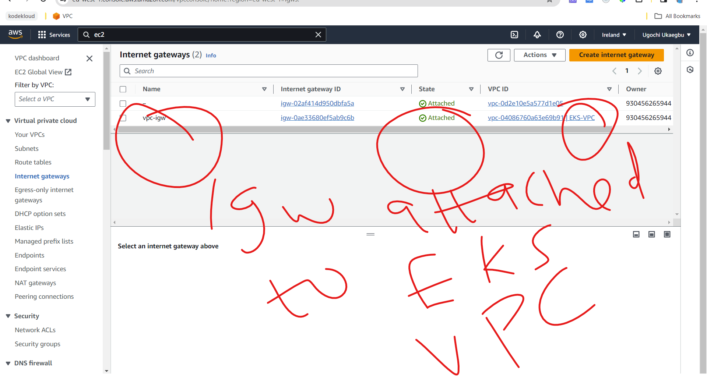
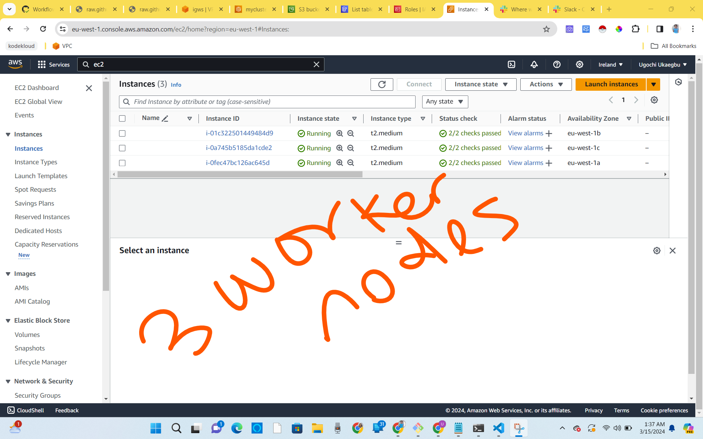

# TOOL USED IN THIS PROJECT
- Github Actions for creating the Elastic Kubernetes Service and installing argocd in the cluster.
- ArgoCD for deploy application on AWS Elastic Kubernetes Service
- Prometheus for monitoring cluster
- Grafana for visualizing metrics gotten with prometheus
- EFK which stands for ElasticSearch Fluentd & Kibana for logging

# GITHUB ACTIONS
Github actions was used to create S3 bucket, DynamoDB table, Kubenetes cluster in AWS and install ArgoCD in the cluster
## TERRAFORM-S3-DB
This directory hold the terraform resources used to create an s3 bucket and a dynamodb table.

The S3 was used to store the terraform state files while dynamodb was used to lock the statefile so that no one can make changes to the state files 

## TERRAFORM-EKS 
This directory contains the necessary resources for creating an EKS cluster using Terraform. This directory holds the Terraform scripts that are responsible for creating AWS EKS (Elastic Kubernetes Service) Cluster on AWS cloud provider
The `terraform-eks` folder contains all the necessary files for creating the EKS cluster which includes:
- iam roles and policies attached to the cluster.
- vpc with public and private subnets in three availability zones.
- Security groups for the worker nodes.
- Keys to access the workernodes within the cluster.

## ARGOCD INSTALLATION
ArgoCD was installed with github actions but first the cluster was accessed with this command `aws eks update-kubeconfig --name <name of cluster>`
To install ArgoCD on your Kubernetes you can go through this [documentation](https://argo-cd.readthedocs.io/en/stable/getting_started/) 

For this project, I clicked on (https://github.com/argoproj/argo-cd/releases/latest) which is the second optio in the documentation above. I was redirected to this github repo (https://github.com/argoproj/argo-cd/releases/tag/v2.9.7). I clicked on releases and used the version `v.2.10.2`

## PROOF OF THE RESOURCES CREATED WITH GITHUB ACTIONS
**Image of github actions executing terraform script**


**Image of VPC, subnets, nat-gateway, eip and route-tables created**





**Images of eks and worker nodes**




# ARGOCD DEPLOYMENT OF SOCKS SHOP APPLICATION
ArgoCD is a declarative, GitOps continuous delivery tool for Kubernetes. It enables developers to manage and deploy applications on Kubernetes clusters using Git repositories as the source of truth for defining the desired application state.


## ACCESSING ARGOCD DASHBOARD
The argocd-server had a cluster ip so the service type was changed to a loadbalancer. This was done by:

- editing argocd server: `kubectl edit svc argocd-server -n argocd`
- changing the type to **LoadBalancer**
- running `kubectl get svc -n argocd`

To get the password for the argocd run:
`kubectl get secret -n argocd`
This will output
```
NAME                          TYPE     DATA   AGE
argocd-initial-admin-secret   Opaque   1      56m
argocd-notifications-secret   Opaque   0      56m
argocd-secret                 Opaque   5      56m

```
To get the initial admin secret run:
`kubectl get secret argocd-initial-admin-secret -o yaml -n argocd`. This will output the information in a yaml format
NOTE: You can also decide to get the output in a json format.

```
apiVersion: v1
data:
  password: YUR2clRHQkQwQUd6a0lyZQ==
kind: Secret
metadata:
  creationTimestamp: "2024-03-06T11:06:21Z"
  name: argocd-initial-admin-secret
  namespace: argocd
  resourceVersion: "1584"
  uid: 36f81d61-9db6-406b-95b0-ee16deb61236
type: Opaque

```
To decrypt the password run:
`echo "YUR2clRHQkQwQUd6a0lyZQ==" | openssl base64 -d ; echo`
Password = aDvrTGBD0AGzkIre


## INSTALL ARGOCD CLI
- Go to (https://github.com/argoproj/argo-cd/releases) which is the link you copied the link to install argocd.
- scroll down to assets
- copy the link address of the cli option you want. For this project I used (https://github.com/argoproj/argo-cd/releases/download/v2.9.7/argocd-linux-amd64)
- run `wget https://github.com/argoproj/argo-cd/releases/download/v2.9.7/argocd-linux-amd64` on your terminal
- make the file executable `sudo chmod +x argocd-linux-amd64`
- move the file to the `/usr/local/bin` directory
- run: argocd (the man pages of argocd will be outputted)

**To Login on to argocd on your terminal run:**
- `argocd login <ip of the argocd-server>`
- input the username and password.

## DEPLOYING SOCK-SHOP APPLICATION ON EKS CLUSTER
**Step 1: Deploy sock-shop yml files**

Create the app project on argocd dashboard by:
  - indicating the project name
  - github repo link
  - path to the sock-shop directory 


Synchronise the app


View the deployment on the terminal with `kubectl get all -n sock-shop`


**Step2: Deploy the routing-policy for sock-shop**
Go through the same process as before but indicate the path to the routing-policy directory

**Images of the application**


# DEPLOYING PROMETHEUS AND GRAFANA APPLICATION ON EKS WITH ARGOCD
Prometheus is 