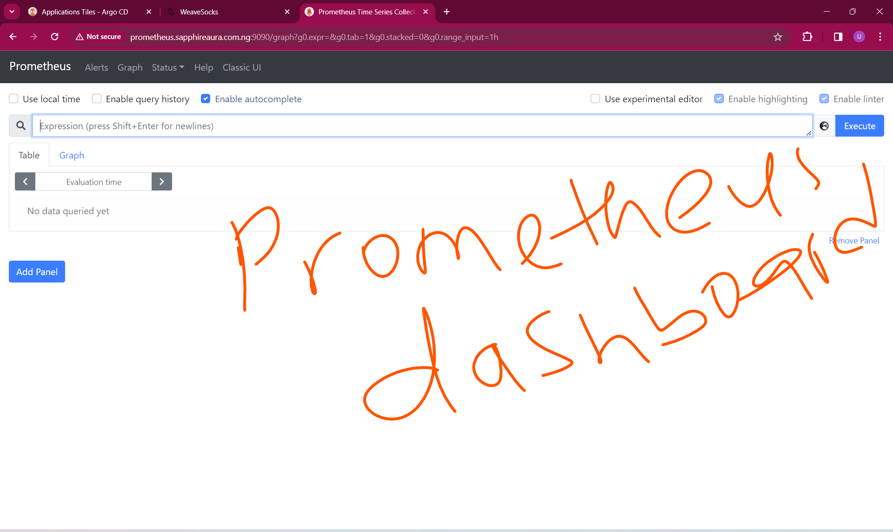
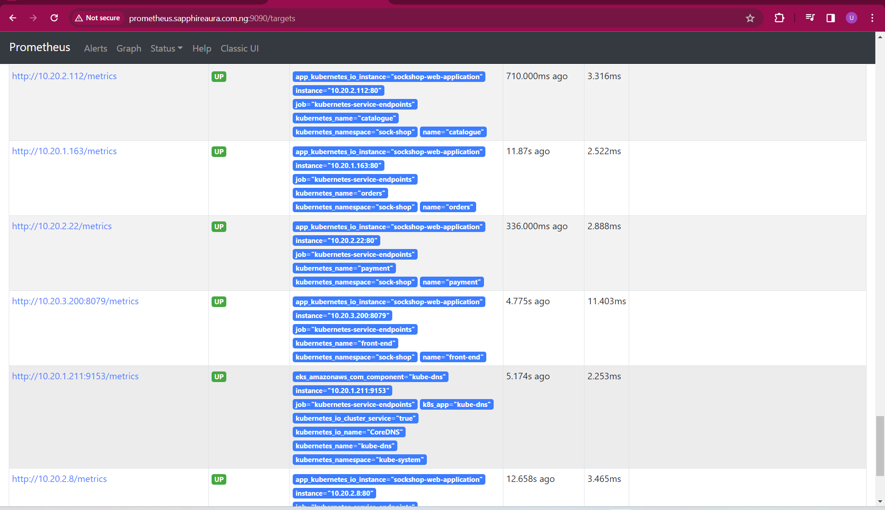

# MICROSERVICE APPLICATION DEPLOYMENT PROCESS
Microservices offer a modular and scalable approach to application development, allowing each component to be developed, deployed, and maintained independently.

### TOOL USED IN THIS PROJECT
- Github Actions for creating the Elastic Kubernetes Service and installing argocd in the cluster.
- ArgoCD for deploy application on AWS Elastic Kubernetes Service
- Prometheus for monitoring cluster
- Grafana for visualizing metrics gotten with prometheus
- ELK which stands for ElasticSearch Logstash & Kibana for logging

   

To see the process of using Github Actions to automate the creation of EKS and installation of ArgoCD, you can refer to ()

To see the process of getting ArgoCD started check ()

## DEPLOYING SOCK-SHOP APPLICATION ON EKS CLUSTER
**Deploy sock-shop yml files**
Argocd can be used to deploy application through the argocd UI or through scripts. 

Create the app project on argocd dashboard by:
  - indicating the project name
  - github repo link
  - path to the sock-shop directory 

This project made use of iac to deploy application with argocd. Check the `argocd-sync` directory to the see the scripts used to deploy. 
To carry out the deployment of the various applications, a bash script containing the names of all argocd script was executed:
  - sock-shop web application
  - sock-shop database
  - monitoring tools like prometheus and grafana
  - logging tools like elastic search and kibanna
  - lets's encrypt certificates.

### PROOF OF DEPLOYMENT ON ARGOCD  DASHBOARD

###  INGRESS-NGINX CONTROLLER  & LET'S ENCRYPT CERTIFICATE
Ingress Nginx Controller is a must have addon when you are using ingress resources in your applications. It acts as a reverse proxy and load balancer, in this case a Network load balancer. It is a Kubernetes resource responsible for managing external access to services within a Kubernetes cluster. It acts as a traffic manager, routing incoming requests to the appropriate services based on defined rules.

Let's Encrypt is a free, automated, and open Certificate Authority (CA) that provides digital certificates for enabling HTTPS (SSL/TLS) encryption on websites. Let's Encrypt certificates are trusted by most modern web browsers, making them suitable for securing websites and web applications.

To  enable https, we need to:
- install ingress-nginx controller (https://kubernetes.github.io/ingress-nginx/deploy/#quick-start)
- install cert manager (https://github.com/cert-manager/cert-manager/releases/tag/v1.14.4)
- install cert manager kubectl plugin
- create a ClusterIssuer (let's encrypt). 
- create an ingress file that will define the rules. 

Check the `letsencrypt` and `ingress` directory to see the files used to create cluster issuer and ingress rules for the application.

## PROOF OF DEPLOYMENT OF A SECURED APPLICATION

## DEPLOYING PROMETHEUS AND GRAFANA APPLICATION ON EKS WITH ARGOCD
Prometheus is an open-source monitoring and alerting toolkit designed for reliability and scalability, specializing in time-series data collection and analysis. 

Grafana is an open-source analytics and visualization platform that integrates with Prometheus and other data sources, offering customizable dashboards and powerful visualization capabilities. 

The same process for deploying the socks web application was used to deploy prometheus and grafana with argocd.
To access grafana dashboard you can use the `kubectl get secret` command like I used in getting the password for argocd but in this case it is different. In the deployment file an environmental variable was set for admin and password.

Input the admin name and password and follow the instruction to change password.
**Step 1**
On the grafana dashboard
- click on data source
- select prometheus
- copy the prometheus url and input in the url input field
- click save & test.

**Step 2**
On the grafana dashboard
- click on create your first dashboard
- click on import
- type in the dashboard number. For this project I will be using (`3662 for a general overview of the cluster` & `3119 for monitoring system`)
- click on load
- click on datasource (prometheus)
- click on import

### PROOF OF APP MONITORING

